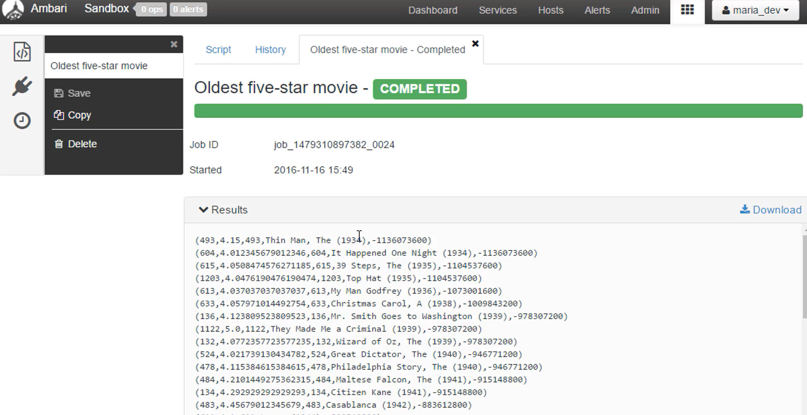

# Pig Script for Analyzing Movie Ratings

## Overview
This script analyzes movie ratings from the MovieLens 100k dataset using Apache Pig. The goal is to find the oldest movies with an average rating greater than 4.0 and display their details.

## Data Sources
1. **Ratings Data**: Contains user ratings for movies.
   - File Path: `/user/maria_dev/ml-100k/u.data`
   - Format: `(userID:int, movieID:int, rating:int, ratingTime:int)`

2. **Metadata**: Contains movie details.
   - File Path: `/user/maria_dev/ml-100k/u.item`
   - Format: Delimited by '|', containing `(movieID:int, movieTitle:chararray, releaseDate:chararray, videoRelease:chararray, imdbLink:chararray)`

## Steps
1. **Load Ratings Data**: Load the ratings data from the specified path.
2. **Load Metadata**: Load the metadata with the specified delimiter.
3. **Generate Name Lookup**: Create a name lookup table with movie ID, title, and release date converted to Unix time.
4. **Group Ratings**: Group the ratings by movie ID.
5. **Calculate Average Ratings**: Calculate the average rating for each movie.
6. **Filter High-Rated Movies**: Filter movies with an average rating greater than 4.0.
7. **Join Data**: Join the high-rated movies with their metadata.
8. **Order Movies**: Order the resulting movies by their release time.
9. **Output Results**: Output the ordered list of movies.

## Execution
To execute the script, use the following command in the Apache Pig environment:

```bash
pig -x local script.pig
